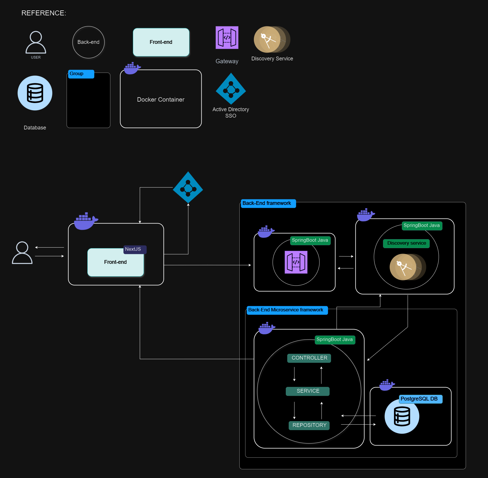

# Backend

- Stack: 
    - Java 17
    - SpringBoot 3.2.3
    - Spring Cloud 2023.0.0
    - Eureka Server / Client
    - Spring-Dotenv 4.0.0
    - PostgreSQL 16

- Architecture:
    - Microservices design
    - Divided in 4 components:
        - Discovery service using Eureka server for clients application registration
        - API Gateway to manage requests for specifc resources and load balancing
        - Auth Server to authenticate and authorize the users
        - Resource Service to provide the resource

    - Architeture Proposal:
            