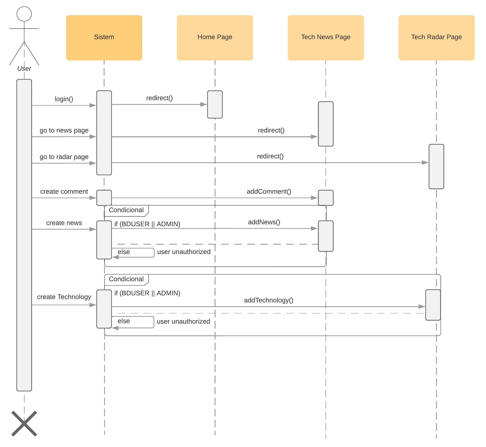
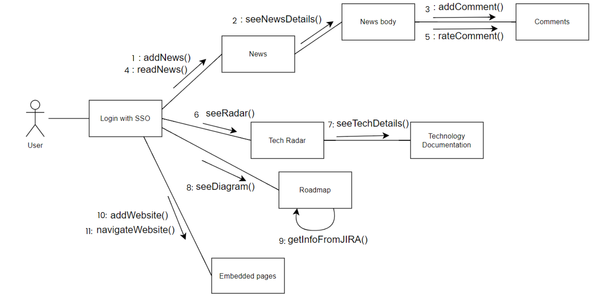

# Software Requirements

## Project Scope

BD Tech Center is a platform aiming to centralize useful features
for the BD digital innovation team (Bosch Digital),
internal software development of the company. The Platform aims to centralize and
facilitate access to tools for the BD/INN team, providing a web application
simple and intuitive for the user to easily find the features available in
different tabs.

## Features

### Tech Articles
Allows all Bosch users
view and comment on articles related to new
market technologies, BD applications and articles in the area.
For BD employees or those with administrative access, you have the
articles creation and control function.

### Tech Radar
Allows all Bosch users
view a radar with the technologies that “will impact the
Bosch”, “are being studied by the company” and which “are in
use”, in addition to each article item having documentation. For
BD employees or with administrative access, has the
article creation and control function.

## Requirements Description

### Functional Requirements
- Employee login:
    - The user must be able to log in to the system with their
    user, via the Bosch SSO service on Azure.

- Tech Radar:
    - The website should display a page with a circular radar that
        present the technologies “that will affect the company”, “that are
        being studied” and “that are in use”.
    - Each technology must be a link to a
        technology documentation.
    - Each documentation must have a tag that represents whether it was
        recently added or updated, or is the same as older
        of a week.

- Articles page:
    - The website must display a page with a article preview through
        of cards.
    - Users should be able to filter article by tags and name
        of the article.
    - Users should be able to click on the article card and be
        directed to a page to read it.

- Comments and rating:
    - Users must be able to comment on article
    - Users must be able to “upvote” the article.

- Link to Bosch Tube:
    - Users must be able to access Bosch Tube (Bosch videos platforms)
        via a link in the navbar.

- Admin actions for TechRadar:
    - Users must be able to create and update documentation for
        technologies.
    - Users must be able to create and update the properties of
        quadrants

- Admin actions for TechArticle:
    - Users must be able to create and update their own articles and
        from other users.

- Actions by BD collaborators for TechRadar:
    - Users must be able to create and update documentation for
        technologies they added.

- Actions by BD collaborators for TechArticles:
    - Users must be able to create and update their own articles

### Non-Functional Requirements

- Performance:
    - The service must load quickly, even on
        heavy load conditions.
    - The service must guarantee fast loading even with
        increase in the number of users.

- Security:
    - There must be encryption of user personal data
    - Users must have different permissions on the service.
    - Access only for authenticated Bosch users.

- Availability:
    - The service must be available most of the time
        possible, with minimal maintenance time.
    - Service must only be on the Bosch network within a
        server
    - The service must be accessed through the browser

- Scalability:
    - The system must be capable of supporting up to 10,000 users
        simultaneous
    - The service can be adapted to other areas of Bosch.
    - The service must have an easy scalability plan that allows
        add new resources and servers.

- Compatibility:
    - The service must be compatible for operating systems
        MacOS, Windows and Linux.
    - It must be compatible with all browsers, especially
        Chrome, Edge and Firefox.

- Usability:
    - The service must be easy to understand and look
        simple.
    - The service must be responsive to notebooks and monitors
        medium to large size.
    - The service is focused on the development, technology and
        innovation.

- Maintenance and Management:
    - The service must contain logs to track and monitor errors.
    - There must be a backup system for data allocated by the
        service user.

## Attachments and Appendices

### Sequence Diagram
A sequence diagram is a type of interaction diagram 
because it describes how and in what order a group 
of objects works together.

### Collaboration Diagram
A colaboration diagram is an illustration of the relationships 
and interactions among software objects in the Unified 
Modeling Language (UML).

